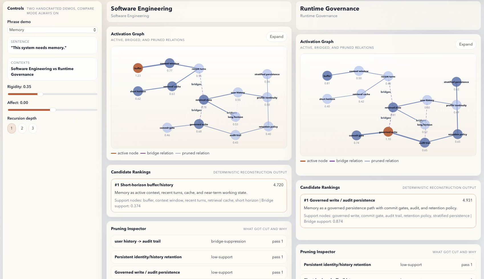
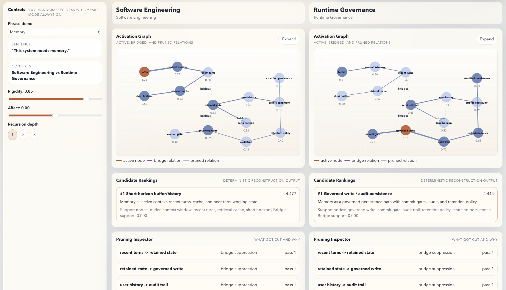
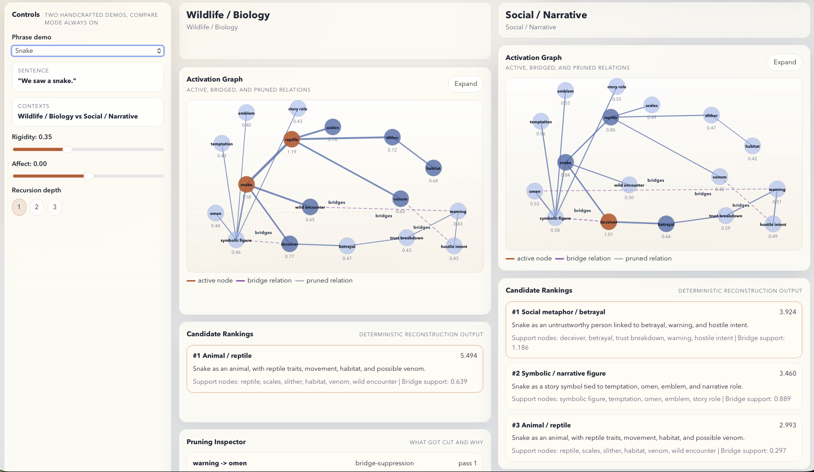
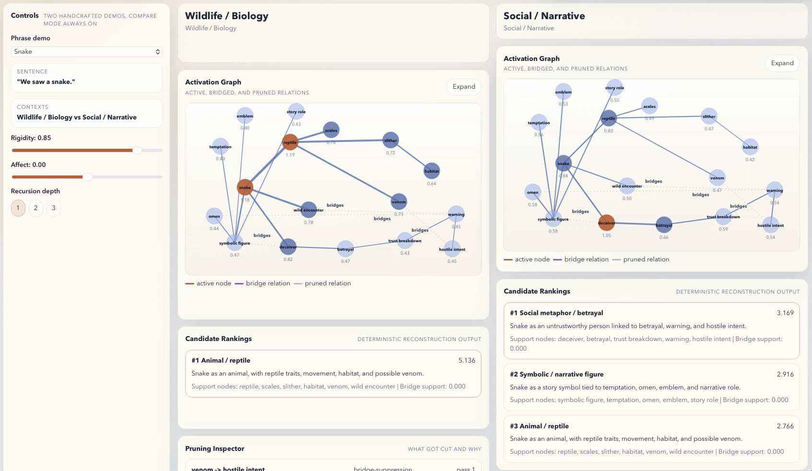
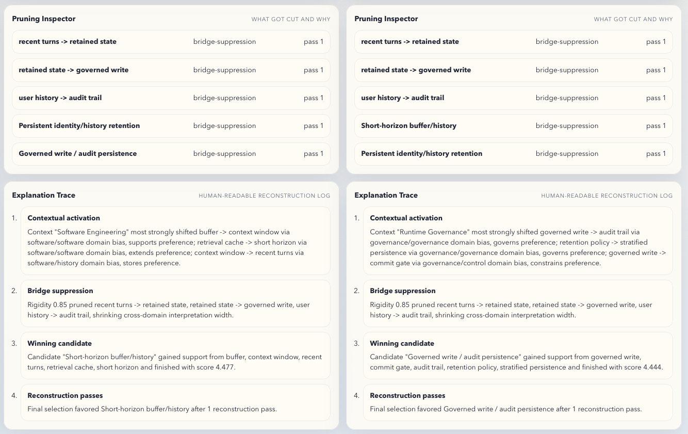
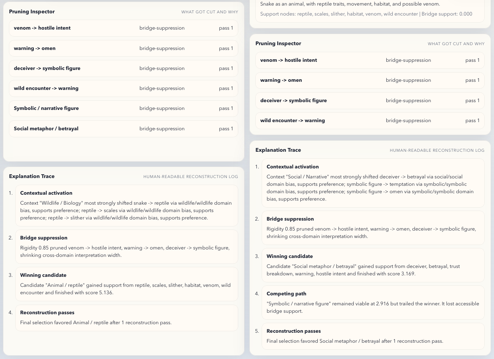

# PUTMAN Interpretive Debugger

A controlled, semi-symbolic debugger for showing **why the same word can mean different things in different contexts**.

This project is a small, inspectable companion demo for the PUTMAN framework. It does **not** claim general language understanding. Instead, it demonstrates a narrow architectural point:

> interpretation does not always fail because someone “didn’t know the definition.”  
> It can diverge because different context packages activate different local structures, and because rigidity can suppress bridge relations that would otherwise keep alternative interpretations accessible.

## What this is

The PUTMAN Interpretive Debugger is a deterministic compare demo built around the pipeline:

`relational encoding -> contextual activation -> constrained reconstruction`

It uses small handcrafted graphs and fixed context pairs to show:

- which local structures activate under a given context
- which candidate interpretations become viable
- which bridge relations remain accessible or get pruned
- why one interpretation wins over another
- how rigidity, affect, and recursion influence reconstruction

## What it is not

This is **not**:

- a chatbot
- a general semantic engine
- an LLM explainer
- a claim of broad NLP competence
- a production-ready agent architecture

It is a **controlled interpretive debugger** for a small number of carefully designed examples.

## Current demos

This version includes exactly **two** handcrafted phrase demos:

- `memory`
- `snake`

These were chosen to keep the system readable while showing that the mechanism is not a one-off.

### `memory`
The jargon-first technical example.

Candidate interpretations:
1. short-horizon buffer/history
2. persistent identity/history retention
3. governed write / audit persistence

Context pair:
- Software Engineering
- Runtime Governance

### `snake`
The ordinary-language contrast.

Candidate interpretations:
1. animal / reptile
2. social metaphor / betrayal
3. symbolic / narrative figure

Context pair:
- Wildlife / Biology
- Social / Narrative

## What the demo demonstrates

### 1. Context-dependent reconstruction
The same surface token can reconstruct differently under different context packages.

Examples:
- `memory` in Software Engineering tends toward short-horizon buffer/history
- `memory` in Runtime Governance tends toward governed persistence and audit
- `snake` in Wildlife / Biology tends toward animal / reptile
- `snake` in Social / Narrative tends toward social metaphor or symbolic figure

### 2. Bridge-sensitive narrowing
Higher rigidity raises pruning thresholds and makes weak bridge relations more vulnerable.

This narrows admissible interpretation space and can collapse plausible alternatives that remain visible at lower rigidity.

### 3. Bounded modulation
Affect and recursion are included as constrained modulators:
- **affect** slightly tilts support toward continuity/history or control/governance patterns
- **recursion depth** mildly reinforces prior winning structure across additional reconstruction passes

These are intended to be visible and inspectable, not dramatic or mystical.

## Interface overview

The debugger is organized as a side-by-side compare view.

For each context, it shows:

- **Activation Graph**  
  active nodes, bridge relations, and pruned relations

- **Candidate Rankings**  
  deterministic reconstruction output with support-node summaries

- **Pruning Inspector**  
  what got cut and why

- **Explanation Trace**  
  a human-readable reconstruction log derived from actual run state

## Controls

- **Phrase demo**  
  switch between `memory` and `snake`

- **Rigidity**  
  raises pruning thresholds and makes bridge relations more vulnerable

- **Affect**  
  applies a small bounded bias to specific relation families

- **Recursion depth**  
  reruns reconstruction up to 3 passes with mild reinforcing carryover

## What to look for

A good first pass is:

### Memory
- compare `Software Engineering` vs `Runtime Governance`
- then raise rigidity and watch bridge relations narrow

### Snake
- compare `Wildlife / Biology` vs `Social / Narrative`
- then raise rigidity and observe cross-domain alternatives tighten

The important point is not only which candidate wins, but **how**:
- what structure was activated
- what bridges remained available
- what got pruned
- what explanation trace the system gives for the result

The included screenshots capture both the top-level compare states and selected lower-panel detail views so the graph outputs can be checked against candidate rankings, pruning behavior, and explanation traces.

## Screenshots

The repository includes a small screenshot set in the top-level 'screenshots/' folder showing the debugger in representative states.

### Top-level compare views

- `screenshots/memory-default-top.png`  
  Default `memory` compare state showing context-dependent reconstruction between Software Engineering and Runtime Governance.

- `screenshots/memory-high-rigidity-top.png`  
  High-rigidity `memory` compare state showing narrower bridge accessibility and tighter candidate competition.

- `screenshots/snake-default-top.png`  
  Default `snake` compare state showing the split between Wildlife / Biology and Social / Narrative.

- `screenshots/snake-high-rigidity-top.png`  
  High-rigidity `snake` compare state showing stronger cross-domain narrowing and reduced bridge accessibility.

### Detail views

- `screenshots/memory-high-rigidity-detail.png`  
  Detail view of candidate rankings, pruning, and explanation trace for the high-rigidity `memory` scenario.

- `screenshots/snake-high-rigidity-detail.png`  
  Detail view of candidate rankings, pruning, and explanation trace for the high-rigidity `snake` scenario.

## Companion paper

This demo is paired with the companion note:

**Interpretive Deviation and Attention Escalation: A Companion Note to the PUTMAN Interpretive Debugger**  
[Zenodo record](https://zenodo.org/records/19191466)

The paper frames the debugger as a narrow demonstration of a broader claim:

- deviation is not only noise or error
- meaning often proceeds through dominant low-cost corridors
- meaningful deviation can activate runner-ups, tighten bridge competition, or justify more expensive resolution

For the broader architectural framework, see:

**PUTMAN Model**  
[Zenodo record](https://zenodo.org/records/18651588)

## Why this project exists

This project was built to make a specific PUTMAN claim visible:

> disagreement and semantic drift can arise from structural activation and pruning, not only from simple definition failure.

That matters for:
- technical jargon
- weak-overlap communication
- cross-domain interpretation
- agent reasoning under constraint
- future deviation-aware interpretive systems

## License

This repository is released under:

**CC BY-NC 4.0**  
See the [LICENSE](./LICENSE) file for details.

## Contact

**Stephen A. Putman**  
Email: `putmanmodel@pm.me`

GitHub: [putmanmodel](https://github.com/putmanmodel)  
X / Twitter: [@putmanmodel](https://x.com/putmanmodel)  
Reddit: [@putmanmodel](https://www.reddit.com/user/putmanmodel/)  
BlueSky: [@putmanmodel.bsky.social](https://bsky.app/profile/putmanmodel.bsky.social)

## Status

Current status: **working narrow demo / v0.2**

The project is intentionally kept small and legible. Future work may extend the demo set, but the priority is to preserve inspectability and avoid overstating what the system does.